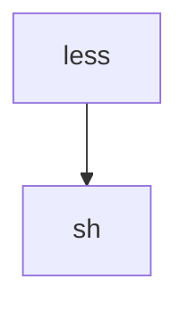
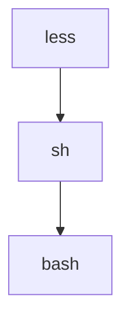
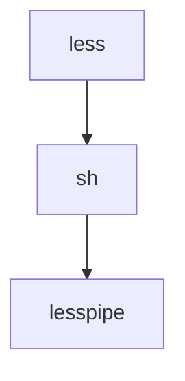
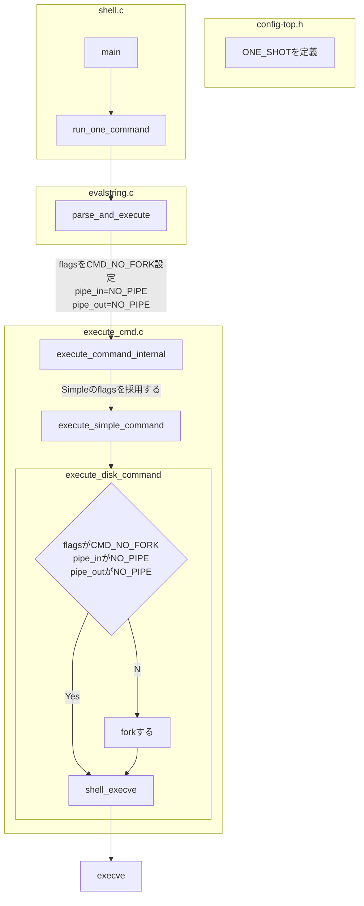

# はじめに

https://x.com/higaki_program/status/1972631649134469317

遅くなりましたが、ブログを書いていきます。

# 結論

`bash` の `-c` オプションの挙動について気になったので、ソースコードを追いかけました。

シンプルコマンドの場合は`fork`しないで`execve`のみを呼び出していました。

# 環境

- Proxmox VE
  - Ubuntu 24.04

# batコマンド

https://github.com/sharkdp/bat/tree/master

cat コマンドの拡張版でシンタックスハイライトやGitの差分も見れるようになったものです。

```
───────┬──────────────────────────────────────────────────────────────────────────────────────────────────
       │ File: workspace/index.php
───────┼──────────────────────────────────────────────────────────────────────────────────────────────────
   1   │ <?php
   2   │ 
   3   │ class Hoge {
   4   │     function hoge() {}
   5   │ };
   6   │ 
   7   │ $hoge = new Hoge();
───────┴──────────────────────────────────────────────────────────────────────────────────────────────────
```

画像も載せておきます。


空白や改行なども全て出力するオプションも用意されています。

変な文字列が紛れていないかを探す時に使えそうです。

```: bat workspace/index.php -A
───────┬──────────────────────────────────────────────────────────────────────────────────────────────────
       │ File: workspace/index.php
───────┼──────────────────────────────────────────────────────────────────────────────────────────────────
   1   │ <?php␊
   2   │ ␊
   3   │ class·Hoge·{␊
   4   │ ····function·hoge()·{}␊
   5   │ };␊
   6   │ ␊
   7   │ $hoge·=·new·Hoge();␊
───────┴──────────────────────────────────────────────────────────────────────────────────────────────────
```

```: bat workspace/index.php -A --nonprintable-notation caret
───────┬──────────────────────────────────────────────────────────────────────────────────────────────────
       │ File: workspace/index.php
───────┼──────────────────────────────────────────────────────────────────────────────────────────────────
   1   │ <?php^J
   2   │ ^J
   3   │ class·Hoge·{^J
   4   │ ····function·hoge()·{}^J
   5   │ };^J
   6   │ ^J
   7   │ $hoge·=·new·Hoge();^J
───────┴──────────────────────────────────────────────────────────────────────────────────────────────────
```

## 自動ページング

> By default, bat pipes its own output to a pager (e.g. less) if the output is too large for one screen. 
> If you would rather bat work like cat all the time (never page output), you can set --paging=never as an option, either on the command line or in your configuration file. 
> If you intend to alias cat to bat in your shell configuration, you can use alias cat='bat --paging=never' to preserve the default behavior.


一画面に収まらない行数の場合は自動でページングで表示してくれます。

:::details 表示結果

```:bat /etc/skel/.bashrc
───────┬──────────────────────────────────────────────────────────────────────────────────────────────────────────────────────────────────────
       │ File: /etc/skel/.bashrc
───────┼──────────────────────────────────────────────────────────────────────────────────────────────────────────────────────────────────────
   1   │ # ~/.bashrc: executed by bash(1) for non-login shells.
   2   │ # see /usr/share/doc/bash/examples/startup-files (in the package bash-doc)
   3   │ # for examples
   4   │ 
   5   │ # If not running interactively, don't do anything
   6   │ case $- in
   7   │     *i*) ;;
   8   │       *) return;;
   9   │ esac
  10   │ 
  11   │ # don't put duplicate lines or lines starting with space in the history.
  12   │ # See bash(1) for more options
  13   │ HISTCONTROL=ignoreboth
  14   │ 
  15   │ # append to the history file, don't overwrite it
  16   │ shopt -s histappend
  17   │ 
  18   │ # for setting history length see HISTSIZE and HISTFILESIZE in bash(1)
  19   │ HISTSIZE=1000
  20   │ HISTFILESIZE=2000
  21   │ 
  22   │ # check the window size after each command and, if necessary,
  23   │ # update the values of LINES and COLUMNS.
:
```
:::

`--paging=never`をつけるとページングしないようにもしてくれます。

:::details 表示結果

```:bat /etc/skel/.bashrc --paging=never
───────┬──────────────────────────────────────────────────────────────────────────────────────────────────────────────────────────────────────
       │ File: /etc/skel/.bashrc
───────┼──────────────────────────────────────────────────────────────────────────────────────────────────────────────────────────────────────
   1   │ # ~/.bashrc: executed by bash(1) for non-login shells.
   2   │ # see /usr/share/doc/bash/examples/startup-files (in the package bash-doc)
   3   │ # for examples
   4   │ 
   5   │ # If not running interactively, don't do anything
   6   │ case $- in
   7   │     *i*) ;;
   8   │       *) return;;
   9   │ esac
  10   │ 
  11   │ # don't put duplicate lines or lines starting with space in the history.
  12   │ # See bash(1) for more options
  13   │ HISTCONTROL=ignoreboth
  14   │ 
  15   │ # append to the history file, don't overwrite it
  16   │ shopt -s histappend
  17   │ 
  18   │ # for setting history length see HISTSIZE and HISTFILESIZE in bash(1)
  19   │ HISTSIZE=1000
  20   │ HISTFILESIZE=2000
  21   │ 
  22   │ # check the window size after each command and, if necessary,
  23   │ # update the values of LINES and COLUMNS.
  24   │ shopt -s checkwinsize
  25   │ 
  26   │ # If set, the pattern "**" used in a pathname expansion context will
  27   │ # match all files and zero or more directories and subdirectories.
  28   │ #shopt -s globstar
  29   │ 
  30   │ # make less more friendly for non-text input files, see lesspipe(1)
  31   │ [ -x /usr/bin/lesspipe ] && eval "$(SHELL=/bin/sh lesspipe)"
  32   │ 
  33   │ # set variable identifying the chroot you work in (used in the prompt below)
  34   │ if [ -z "${debian_chroot:-}" ] && [ -r /etc/debian_chroot ]; then
  35   │     debian_chroot=$(cat /etc/debian_chroot)
  36   │ fi
  37   │ 
  38   │ # set a fancy prompt (non-color, unless we know we "want" color)
  39   │ case "$TERM" in
  40   │     xterm-color|*-256color) color_prompt=yes;;
  41   │ esac
  42   │ 
  43   │ # uncomment for a colored prompt, if the terminal has the capability; turned
  44   │ # off by default to not distract the user: the focus in a terminal window
  45   │ # should be on the output of commands, not on the prompt
  46   │ #force_color_prompt=yes
  47   │ 
  48   │ if [ -n "$force_color_prompt" ]; then
  49   │     if [ -x /usr/bin/tput ] && tput setaf 1 >&/dev/null; then
  50   │     # We have color support; assume it's compliant with Ecma-48
  51   │     # (ISO/IEC-6429). (Lack of such support is extremely rare, and such
  52   │     # a case would tend to support setf rather than setaf.)
  53   │     color_prompt=yes
  54   │     else
  55   │     color_prompt=
  56   │     fi
  57   │ fi
  58   │ 
  59   │ if [ "$color_prompt" = yes ]; then
  60   │     PS1='${debian_chroot:+($debian_chroot)}\[\033[01;32m\]\u@\h\[\033[00m\]:\[\033[01;34m\]\w\[\033[00m\]\$ '
  61   │ else
  62   │     PS1='${debian_chroot:+($debian_chroot)}\u@\h:\w\$ '
  63   │ fi
  64   │ unset color_prompt force_color_prompt
  65   │ 
  66   │ # If this is an xterm set the title to user@host:dir
  67   │ case "$TERM" in
  68   │ xterm*|rxvt*)
  69   │     PS1="\[\e]0;${debian_chroot:+($debian_chroot)}\u@\h: \w\a\]$PS1"
  70   │     ;;
  71   │ *)
  72   │     ;;
  73   │ esac
  74   │ 
  75   │ # enable color support of ls and also add handy aliases
  76   │ if [ -x /usr/bin/dircolors ]; then
  77   │     test -r ~/.dircolors && eval "$(dircolors -b ~/.dircolors)" || eval "$(dircolors -b)"
  78   │     alias ls='ls --color=auto'
  79   │     #alias dir='dir --color=auto'
  80   │     #alias vdir='vdir --color=auto'
  81   │ 
  82   │     alias grep='grep --color=auto'
  83   │     alias fgrep='fgrep --color=auto'
  84   │     alias egrep='egrep --color=auto'
  85   │ fi
  86   │ 
  87   │ # colored GCC warnings and errors
  88   │ #export GCC_COLORS='error=01;31:warning=01;35:note=01;36:caret=01;32:locus=01:quote=01'
  89   │ 
  90   │ # some more ls aliases
  91   │ alias ll='ls -alF'
  92   │ alias la='ls -A'
  93   │ alias l='ls -CF'
  94   │ 
  95   │ # Add an "alert" alias for long running commands.  Use like so:
  96   │ #   sleep 10; alert
  97   │ alias alert='notify-send --urgency=low -i "$([ $? = 0 ] && echo terminal || echo error)" "$(history|tail -n1|sed -e '\''s/^\s*[0-9]\+
       │ \s*//;s/[;&|]\s*alert$//'\'')"'
  98   │ 
  99   │ # Alias definitions.
 100   │ # You may want to put all your additions into a separate file like
 101   │ # ~/.bash_aliases, instead of adding them here directly.
 102   │ # See /usr/share/doc/bash-doc/examples in the bash-doc package.
 103   │ 
 104   │ if [ -f ~/.bash_aliases ]; then
 105   │     . ~/.bash_aliases
 106   │ fi
 107   │ 
 108   │ # enable programmable completion features (you don't need to enable
 109   │ # this, if it's already enabled in /etc/bash.bashrc and /etc/profile
 110   │ # sources /etc/bash.bashrc).
 111   │ if ! shopt -oq posix; then
 112   │   if [ -f /usr/share/bash-completion/bash_completion ]; then
 113   │     . /usr/share/bash-completion/bash_completion
 114   │   elif [ -f /etc/bash_completion ]; then
 115   │     . /etc/bash_completion
 116   │   fi
 117   │ fi
───────┴──────────────────────────────────────────────────────────────────────────────────────────────────────────────────────────────────────
```

:::

## 自分環境でのページングの実行結果

```
$ pstree
...
systemd─┬─2*[agetty]
...
        ├─sshd─┬─sshd───sshd───bash───bat───less
        │      └─sshd───sshd───bash───pstree
...
```

裏側で `less` が呼ばれていました。

`$ strace -f -o bat_trace2 bat /etc/skel/.profile` でシステムコール単位で`bat`を追いかけてみました。

```: bat_trace
186063 execve("/home/dev/.local/bin/bat", ["bat", "/etc/skel/.profile"], 0x7ffd07d12d20 /* 27 vars */) = 0
186064 execve("/home/dev/.local/bin/less", ["less", "--version"], 0x7ffc755e4190 /* 27 vars */) = -1 ENOENT (No such file or directory)
186064 execve("/home/dev/.local/share/mise/installs/node/24.9.0/bin/less", ["less", "--version"], 0x7ffc755e4190 /* 27 vars */) = -1 ENOENT (No such file or directory)
186064 execve("/home/dev/.cargo/bin/less", ["less", "--version"], 0x7ffc755e4190 /* 27 vars */) = -1 ENOENT (No such file or directory)
186064 execve("/usr/local/sbin/less", ["less", "--version"], 0x7ffc755e4190 /* 27 vars */) = -1 ENOENT (No such file or directory)
186064 execve("/usr/local/bin/less", ["less", "--version"], 0x7ffc755e4190 /* 27 vars */) = -1 ENOENT (No such file or directory)
186064 execve("/usr/sbin/less", ["less", "--version"], 0x7ffc755e4190 /* 27 vars */) = -1 ENOENT (No such file or directory)
186064 execve("/usr/bin/less", ["less", "--version"], 0x7ffc755e4190 /* 27 vars */) = 0
186064 +++ exited with 0 +++
186063 --- SIGCHLD {si_signo=SIGCHLD, si_code=CLD_EXITED, si_pid=186064, si_uid=1000, si_status=0, si_utime=0, si_stime=0} ---
186065 execve("/home/dev/.local/bin/less", ["less", "-R", "-F"], 0x5634e9e79a80 /* 28 vars */) = -1 ENOENT (No such file or directory)
186065 execve("/home/dev/.local/share/mise/installs/node/24.9.0/bin/less", ["less", "-R", "-F"], 0x5634e9e79a80 /* 28 vars */) = -1 ENOENT (No such file or directory)
186065 execve("/home/dev/.cargo/bin/less", ["less", "-R", "-F"], 0x5634e9e79a80 /* 28 vars */) = -1 ENOENT (No such file or directory)
186065 execve("/usr/local/sbin/less", ["less", "-R", "-F"], 0x5634e9e79a80 /* 28 vars */) = -1 ENOENT (No such file or directory)
186065 execve("/usr/local/bin/less", ["less", "-R", "-F"], 0x5634e9e79a80 /* 28 vars */) = -1 ENOENT (No such file or directory)
186065 execve("/usr/sbin/less", ["less", "-R", "-F"], 0x5634e9e79a80 /* 28 vars */) = -1 ENOENT (No such file or directory)
186065 execve("/usr/bin/less", ["less", "-R", "-F"], 0x5634e9e79a80 /* 28 vars */) = 0
186063 --- SIGWINCH {si_signo=SIGWINCH, si_code=SI_KERNEL} ---
186065 --- SIGWINCH {si_signo=SIGWINCH, si_code=SI_KERNEL} ---
186065 +++ exited with 0 +++
186063 --- SIGCHLD {si_signo=SIGCHLD, si_code=CLD_EXITED, si_pid=186065, si_uid=1000, si_status=0, si_utime=0, si_stime=0} ---
186063 +++ exited with 0 +++
```

様々な`less`が呼び出されていました。`bat`は`/usr/bin/less`がないような様々な環境で実行できることを想定して手当たり次第に`less`の実行を試みているのかなを思いを馳せました。

`less` コマンドについても`$ strace -f -o less_trace -e execve less /etc/skel/.profile`でシステムコール単位で調べました。

```:less_trace
172035 execve("/usr/bin/less", ["less", "/etc/skel/.profile"], 0x7ffe70a446c0 /* 27 vars */) = 0
172036 execve("/bin/sh", ["sh", "-c", "--", "/bin/bash -c \\ /usr/bin/lesspipe"...], 0x7ffc12071f00 /* 27 vars */) = 0
172037 execve("/bin/bash", ["/bin/bash", "-c", " /usr/bin/lesspipe /etc/skel/.pr"...], 0x64e59318b958 /* 27 vars */) = 0
172037 execve("/usr/bin/lesspipe", ["/usr/bin/lesspipe", "/etc/skel/.profile"], 0x56af5e244620 /* 27 vars */) = 0
172038 execve("/usr/bin/basename", ["basename", "/usr/bin/lesspipe"], 0x60843bb20a38 /* 27 vars */) = 0
172038 +++ exited with 0 +++
172037 --- SIGCHLD {si_signo=SIGCHLD, si_code=CLD_EXITED, si_pid=172038, si_uid=1000, si_status=0, si_utime=0, si_stime=0} ---
172041 +++ exited with 0 +++
172040 --- SIGCHLD {si_signo=SIGCHLD, si_code=CLD_EXITED, si_pid=172041, si_uid=1000, si_status=0, si_utime=0, si_stime=0} ---
172042 execve("/usr/bin/tr", ["tr", "[:upper:]", "[:lower:]"], 0x60843bb2c9d0 /* 27 vars */) = 0
172042 +++ exited with 0 +++
172040 --- SIGCHLD {si_signo=SIGCHLD, si_code=CLD_EXITED, si_pid=172042, si_uid=1000, si_status=0, si_utime=0, si_stime=0} ---
172040 +++ exited with 0 +++
172039 --- SIGCHLD {si_signo=SIGCHLD, si_code=CLD_EXITED, si_pid=172040, si_uid=1000, si_status=0, si_utime=0, si_stime=0} ---
172039 +++ exited with 0 +++
172037 --- SIGCHLD {si_signo=SIGCHLD, si_code=CLD_EXITED, si_pid=172039, si_uid=1000, si_status=0, si_utime=0, si_stime=0} ---
172037 +++ exited with 0 +++
172036 --- SIGCHLD {si_signo=SIGCHLD, si_code=CLD_EXITED, si_pid=172037, si_uid=1000, si_status=0, si_utime=0, si_stime=0} ---
172036 +++ exited with 0 +++
172035 --- SIGCHLD {si_signo=SIGCHLD, si_code=CLD_EXITED, si_pid=172036, si_uid=1000, si_status=0, si_utime=0, si_stime=0} ---
172035 --- SIGWINCH {si_signo=SIGWINCH, si_code=SI_KERNEL} ---
172035 +++ exited with 0 +++
```

ここで、`bash`から`less`を呼び出しているのに、同じPID`172037`になっているのが気になりました。

```
172037 execve("/bin/bash", ["/bin/bash", "-c", " /usr/bin/lesspipe /etc/skel/.pr"...], 0x64e59318b958 /* 27 vars */) = 0
172037 execve("/usr/bin/lesspipe", ["/usr/bin/lesspipe", "/etc/skel/.profile"], 0x56af5e244620 /* 27 vars */) = 0
```

自分の知識では、基本的に`shell`は`cd`などのbuiltinのコマンド以外は別プロセスを生み出すと思っていたので、すごく気になりました。

:::details builtinかどうかチェックするコマンド

```shell
$ type cd
cd is a shell builtin
```

```shell
$ type ls
ls is /bin/ls
```

:::

## なぜ同じプロセスになっている

この部分だけに注目して流れを追っていきます。

```
172035 execve("/usr/bin/less", ["less", "/etc/skel/.profile"], 0x7ffe70a446c0 /* 27 vars */) = 0
172036 execve("/bin/sh", ["sh", "-c", "--", "/bin/bash -c \\ /usr/bin/lesspipe"...], 0x7ffc12071f00 /* 27 vars */) = 0
172037 execve("/bin/bash", ["/bin/bash", "-c", " /usr/bin/lesspipe /etc/skel/.pr"...], 0x64e59318b958 /* 27 vars */) = 0
172037 execve("/usr/bin/lesspipe", ["/usr/bin/lesspipe", "/etc/skel/.profile"], 0x56af5e244620 /* 27 vars */) = 0
```

まずは、`less`プロセスの中で`sh`プロセスが生成されています。

```
172035 execve("/usr/bin/less", ["less", "/etc/skel/.profile"], 0x7ffe70a446c0 /* 27 vars */) = 0
172036 execve("/bin/sh", ["sh", "-c", "--", "/bin/bash -c \\ /usr/bin/lesspipe"...], 0x7ffc12071f00 /* 27 vars */) = 0
```



続いて、`sh`プロセスから`bash`プロセスが生成されています。

```
172036 execve("/bin/sh", ["sh", "-c", "--", "/bin/bash -c \\ /usr/bin/lesspipe"...], 0x7ffc12071f00 /* 27 vars */) = 0
172037 execve("/bin/bash", ["/bin/bash", "-c", " /usr/bin/lesspipe /etc/skel/.pr"...], 0x64e59318b958 /* 27 vars */) = 0
```



そして、`bash`プロセスが`lesspipie`プロセスに生まれ変わっています。

```
172037 execve("/bin/bash", ["/bin/bash", "-c", " /usr/bin/lesspipe /etc/skel/.pr"...], 0x64e59318b958 /* 27 vars */) = 0
172037 execve("/usr/bin/lesspipe", ["/usr/bin/lesspipe", "/etc/skel/.profile"], 0x56af5e244620 /* 27 vars */) = 0
```



# bash

`-c`が怪しいです。

まずは、`man` コマンドで`bash`について見てみます。

```shell
       -c        If the -c option is present, then commands are read from the first non-option argument command_string.  If there are  ar‐
                 guments  after  the  command_string, the first argument is assigned to $0 and any remaining arguments are assigned to the
                 positional parameters.  The assignment to $0 sets the name of the shell, which is used in warning and error messages.
```

シェルに渡すコマンドを文字列から受け取れるオプションのようです。


```shell:例
$ bash -c 'sleep 100'
```

しかし、どこにもプロセスIDについての記載がないので、裏側でどのような処理になっているかソースコードから追いかけてみました。


ソースコードは

https://ftp.riken.jp/GNU/bash/

を参照しました。

## ソースコードを追いかける

最初にざっくり概要をまとめておくと、



のようになっています。

それでは実際に追いかけていきます。

まず、`config-top.h`に

```c:config-top.h
/* Define ONESHOT if you want sh -c 'command' to avoid forking to execute
   `command' whenever possible.  This is a big efficiency improvement. */
#define ONESHOT
```

と記載がされているので`-c`オプションを指定した際は最適化のために可能な限り`fork`なしで実行する旨が書かれています。

さらに、読み進めていきます。

`shell.c`に`main`関数があり、その中で`ONESHOT`が定義されているときは`run_one_command (command_execution_string);`を実行する処理になっています。

```c:shell.c
int
main (int argc, char **argv, char **env)

...

#if defined (ONESHOT)
      executing = shell_initialized = 1;
      run_one_command (command_execution_string);
      exit_shell (last_command_exit_value);
#else /* ONESHOT */
...
#endif /* !ONESHOT */
```

`run_one_command`では`parse_and_execute`を実行しています。

```c:shell.c
#if defined (ONESHOT)
/* Run one command, given as the argument to the -c option.  Tell
   parse_and_execute not to fork for a simple command. */
static int
run_one_command (char *command)
{
  int code;

...

   return (parse_and_execute (savestring (command), "-c", SEVAL_NOHIST|SEVAL_RESETLINE));
}
#endif /* ONESHOT */
```

`parse_and_execute`の中では、

```c
		  command->value.Simple->flags |= CMD_NO_FORK;
```

で`command`が設定されて、
```
int pipe_in = NO_PIPE
int pipe_out = NO_PIPE
```
で`execute_command_internal`を実行しています。

```c:evalstring.c
int
parse_and_execute (char *string, const char *from_file, int flags)
{
  int code, lreset, ignore_return;
  volatile int should_jump_to_top_level, last_result;
  COMMAND *volatile command;
  volatile sigset_t pe_sigmask;

...

#if defined (ONESHOT)
	      /*
	       * IF
	       *   we were invoked as `bash -c' (startup_state == 2) AND
	       *   parse_and_execute has not been called recursively AND
	       *   we're not running a trap AND
	       *   we have parsed the full command (string == '\0') AND
	       *   we're not going to run the exit trap AND
	       *   we have a simple command without redirections AND
	       *   the command is not being timed AND
	       *   the command's return status is not being inverted AND
	       *   there aren't any traps in effect
	       * THEN
	       *   tell the execution code that we don't need to fork
	       */
	      if (should_suppress_fork (command))
		{
		  command->flags |= CMD_NO_FORK;
		  command->value.Simple->flags |= CMD_NO_FORK;
		}

...

#endif /* ONESHOT */

...

		last_result = execute_command_internal
				(command, 0, NO_PIPE, NO_PIPE, bitmap);
				
...
```

`execute_command_internal`では、`execute_simple_command`を実行しています。

```c:execute_cmd.c
/* Execute the command passed in COMMAND, perhaps doing it asynchronously.
   COMMAND is exactly what read_command () places into GLOBAL_COMMAND.
   ASYNCHRONOUS, if non-zero, says to do this command in the background.
   PIPE_IN and PIPE_OUT are file descriptors saying where input comes
   from and where it goes.  They can have the value of NO_PIPE, which means
   I/O is stdin/stdout.
   FDS_TO_CLOSE is a list of file descriptors to close once the child has
   been forked.  This list often contains the unusable sides of pipes, etc.

   EXECUTION_SUCCESS or EXECUTION_FAILURE are the only possible
   return values.  Executing a command with nothing in it returns
   EXECUTION_SUCCESS. */
int
execute_command_internal (COMMAND *command, int asynchronous, int pipe_in, int pipe_out, struct fd_bitmap *fds_to_close)
{
...
  switch (command->type)
    {
    case cm_simple:
...
	exec_result =
	  execute_simple_command (command->value.Simple, pipe_in, pipe_out,
				  asynchronous, fds_to_close);
...
      break;

    case cm_for:
...
```

`execute_simple_command`では`execute_disk_command`を実行しています。

```c:execute_cmd.c
/* The meaty part of all the executions.  We have to start hacking the
   real execution of commands here.  Fork a process, set things up,
   execute the command. */
static int
execute_simple_command (SIMPLE_COM *simple_command, int pipe_in, int pipe_out, int async, struct fd_bitmap *fds_to_close)
{
  WORD_LIST *words, *lastword;
  char *command_line, *lastarg, *temp;
  int first_word_quoted, result, builtin_is_special, already_forked, dofork;
  int fork_flags, cmdflags;

...

  cmdflags = simple_command->flags;

...

  result = execute_disk_command (words, simple_command->redirects, command_line,
			pipe_in, pipe_out, async, fds_to_close,
			cmdflags);
```

`execute_disk_command`で、パイプの設定から`fork`するかしないかを決定し、`shell_execve`を実行します。

ちなみに、`fork`は`make_child`の中で行われています。

```c:execute_cmd.c
static int
execute_disk_command (WORD_LIST *words, REDIRECT *redirects, char *command_line,
		      int pipe_in, int pipe_out, int async,
		      struct fd_bitmap *fds_to_close, int cmdflags)
{
  char *pathname, *command, **args, *p;
  int nofork, stdpath, result, fork_flags;
  pid_t pid;
  
...

  nofork = (cmdflags & CMD_NO_FORK);	/* Don't fork, just exec, if no pipes */

...

  /* We have to make the child before we check for the non-existence
     of COMMAND, since we want the error messages to be redirected. */
  /* If we can get away without forking and there are no pipes to deal with,
     don't bother to fork, just directly exec the command. */
  if (nofork && pipe_in == NO_PIPE && pipe_out == NO_PIPE)
    pid = 0;
  else
    {
      fork_flags = async ? FORK_ASYNC : 0;
      pid = make_child (p = savestring (command_line), fork_flags);
    }

  if (pid == 0)
    {
      int old_interactive;

...

      /* Execve expects the command name to be in args[0].  So we
	 leave it there, in the same format that the user used to
	 type it in. */
      args = strvec_from_word_list (words, 0, 0, (int *)NULL);
      exit (shell_execve (command, args, export_env));
    }
```

`shell_execve`で`execve`が呼ばれています。

```c:execute_cmd.c
/* Call execve (), handling interpreting shell scripts, and handling
   exec failures. */
int
shell_execve (char *command, char **args, char **env)
{
  int i, fd, sample_len;
  char sample[HASH_BANG_BUFSIZ];
  size_t larray;

  SETOSTYPE (0);		/* Some systems use for USG/POSIX semantics */
  execve (command, args, env);
  i = errno;			/* error from execve() */
  CHECK_TERMSIG;
  SETOSTYPE (1);
...
```

`fork`なしで`execve`を呼び出しているのでPIDが変わらなさそうです。

# まとめ

今回は、`bat`コマンドの気になる部分を追いかけていくと`bash`の`-c`オプションについて少し詳しく慣れました。

`bash`が最適化のために`fork`なしでコマンドを実行していることが知れて良い機会でした。

`dash -c`は内部挙動が変わってそうなので、それもいつか追いかけてみたいです。

また、`lesspipe`について気になったので、`lesspipe`についても調べてみます。