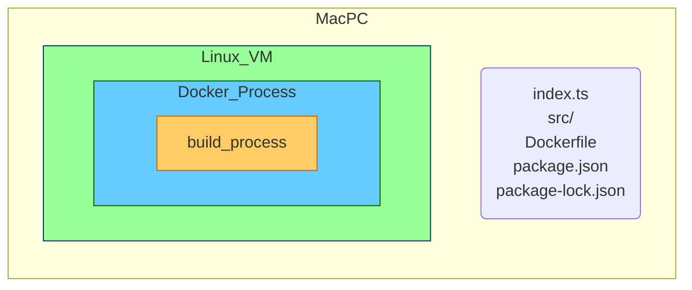
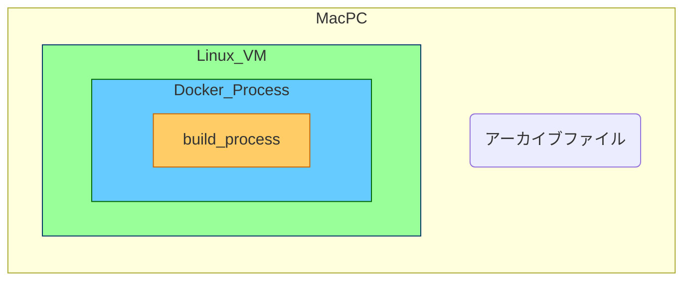
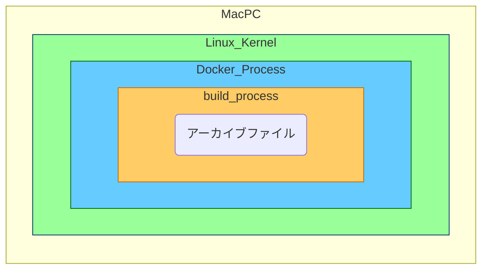
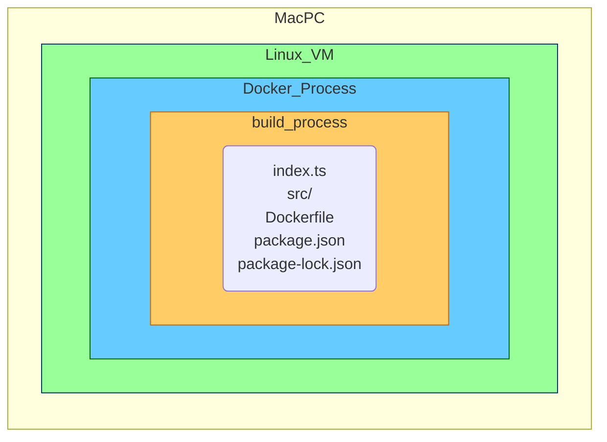
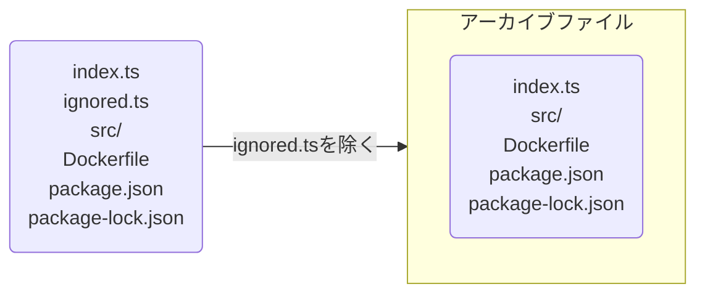

# 背景

みなさんも「dockerのbuild contextについて説明してクレメンス」と突然聞かれれることありますよね

みなさんなら説明できると思うのですが、

僕は、もう疲れちゃって 全然わからなくてェ...

調べてみたのでまとめておきます

色々手助けしてくださったN先輩いつもありがとうございます(๑╹ω╹๑ )

# 結論

dockerのbuild contextとは、「dockerのbuild時にアクセスできるファイル群」です。

そのファイル群の実態は、「[アーカイブファイル](https://wa3.i-3-i.info/word11512.html)やテキストファイル」となっています。

これだけ聞いても、はて？？って感じだと思うので、[公式サイト](https://docs.docker.com/build/building/context
)を参考に説明追加していきます。

# 説明

## そもそもdocker buildとは

公式サイトによると、
> The docker build and docker buildx build commands build Docker images from a Dockerfile and a context.

dockerfileとcontextからDocker imageを作成するコマンドみたいです。

実際のコマンドは以下です。

```shell
  docker build [OPTIONS] PATH | URL | -
                         ^^^^^^^^^^^^^^
```

`^^^^^^^^^^^^^^`で指定されている部分がbuild contextを指定する部分です。

皆さんはよく

```
docker build .
```

の形で使用しているのではないでしょうか？？

## 動作の説明

`docker build` の挙動について説明します

```
.
├── index.ts
├── src/
├── Dockerfile
├── package.json
└── package-lock.json
```

のディレクトリで `docker build .`を行うと、



まず、
`.` で指定したbuild contextを`tar`で`tarball(アーカイブファイル)`にします



>A plain-text file or tarball piped to the docker build command through standard input

標準入力を通して、build processにアーカイブファイルを渡します。



そして、アーカイブファイルを展開して、Dockerfileに基づいてimageを作成していきます。




## .dockerignore

そうすると、`.dockerignore`についてもより理解が進みそうです！

公式サイトによると、

>You can use a .dockerignore file to exclude files or directories from the build context.

build contextから除去したいファイルを指定できるみたいです。

つまり、`tarball（アーカイブファイル）`にするタイミングで指定したファイルを除去する

### 具体例

```
.
├── index.ts
├── ignored.ts
├── .dockerignore
├── src/
├── Dockerfile
├── package.json
└── package-lock.json
```

```:.dockerignore
ignored.ts
```



# まとめ

簡単にですが、docker buildについてまとめてみました

少しでも学習の助けになれば幸いです
