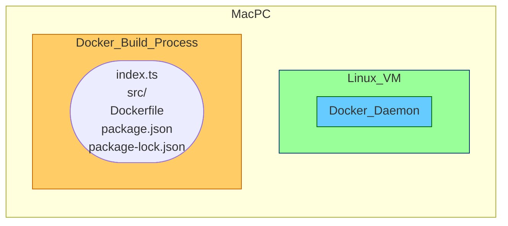
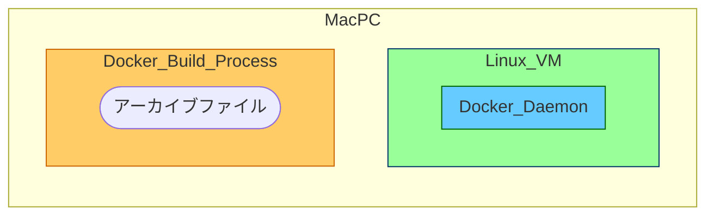
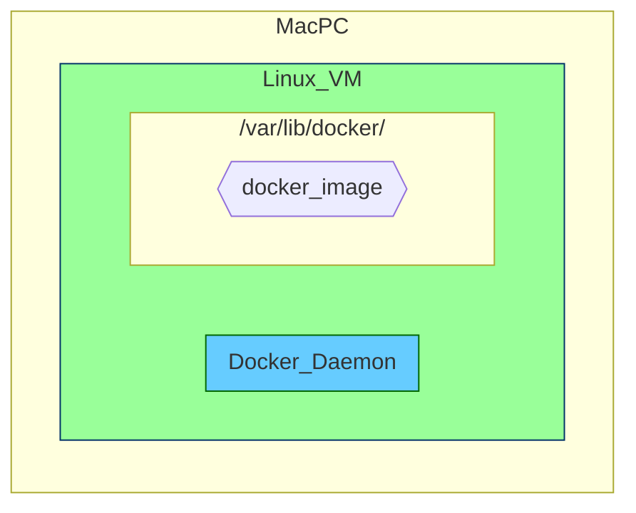
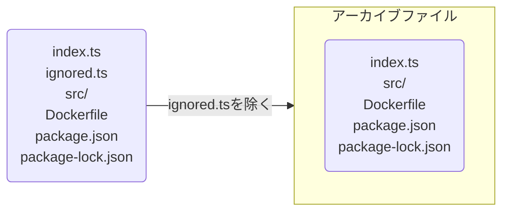

# 背景

みなさんも「dockerのbuild contextについて説明してクレメンス」と突然聞かれることありますよね。

みなさんなら説明できると思うのですが、

僕は、もう疲れちゃって 全然わからなくてェ...

調べてみたのでまとめておきます。

色々手助けしてくださったN先輩いつもありがとうございます(๑╹ω╹๑ )

# 結論

dockerのbuild contextとは、「dockerのbuild時にアクセスできるファイル群」です。

そのファイル群の実態は、「[アーカイブファイル](https://wa3.i-3-i.info/word11512.html)やテキストファイル」となっています。

これだけ聞いても、はて？？って感じだと思うので、[公式サイト](https://docs.docker.com/build/building/context
)を参考に説明追加していきます。

※今回はアーカイブファイルに絞った説明です。テキストファイルは省きます。

# 説明

## そもそもdocker buildとは

公式サイトによると、
> The docker build and docker buildx build commands build Docker images from a Dockerfile and a context.

dockerfileとcontextからDocker imageを作成するコマンドみたいです。

実際のコマンドは以下です。

```shell
  docker build [OPTIONS] PATH | URL | -
                         ^^^^^^^^^^^^^^
```

`^^^^^^^^^^^^^^`で指定されている部分がbuild contextを指定する部分です。

皆さんはよく

```
docker build .
```

の形で使用しているのではないでしょうか？？

## 動作の説明

`docker build` の挙動について説明します

```
.
├── index.ts
├── src/
├── Dockerfile
├── package.json
└── package-lock.json
```

のディレクトリで `docker build .`を行うと、


>This example specifies that the PATH is ., and so tars all the files in the local directory and sends them to the Docker daemon.
https://docs.docker.com/reference/cli/docker/image/build/#build-with-path

まず、`.` で指定したbuild contextを`tar`で`tarball(アーカイブファイル)`にします。



>This example specifies that the PATH is ., and so tars all the files in the local directory and sends them to the Docker daemon.
https://docs.docker.com/reference/cli/docker/image/build/#build-with-path

>
> 

次に、Docker Daemon へアーカイブファイルを送信します。

Docker Daemon へは UNIXドメインソケット や TCP通信 を通して渡されます。


その後、Docker Daemon で Dockerfile と アーカイブファイルから Docker image が作成されます。

（ちなみに、Mac + RancherDesktop のデフォルト設定だと Docker image は LinuxVM の `/var/lib/docker/以下` に作られます）




## .dockerignore

そうすると、`.dockerignore`についてもより理解が進みそうです！

公式サイトによると、

>You can use a .dockerignore file to exclude files or directories from the build context.

build contextから除去したいファイルを指定できるみたいです。

つまり、`tarball（アーカイブファイル）`にするタイミングで指定したファイルを除去しています。

### 具体例

```
.
├── index.ts
├── ignored.ts
├── .dockerignore
├── src/
├── Dockerfile
├── package.json
└── package-lock.json
```

```:.dockerignore
ignored.ts
```



# まとめ

簡単にですが、docker buildについてまとめてみました。

少しでも学習の助けになれば幸いです。
