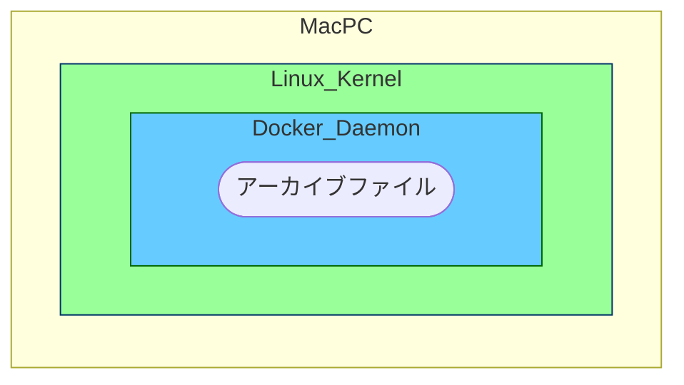
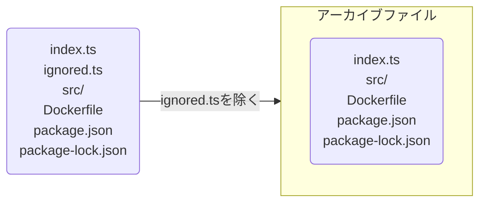

# 背景

みなさんも「dockerのbuild contextについて説明してクレメンス」と突然聞かれることありますよね。

みなさんなら説明できると思うのですが、

僕は、もう疲れちゃって 全然わからなくてェ...

調べてみたのでまとめておきます。

# 結論

dockerのbuild contextとは、「dockerのbuild時にアクセスできるファイル群」です。

そのファイル群の実態は、「[アーカイブファイル](https://wa3.i-3-i.info/word11512.html)やテキストファイル」となっています。

これだけ聞いても、はて？？って感じだと思うので、[公式サイト](https://docs.docker.com/)を参考に説明追加していきます。

:::message
今回の記事では以下を説明対象にします。

- contextの種類
    - アーカイブファイルに絞り、テキストファイルは省きます
- 環境
    - Macを対象とします。それ以外の環境は適宜読み替えてください
:::

# 説明

build contextの解説に入る前に、前提として「dockerコマンドがどのように実行されるか」を解説します。

## 前提知識

>The Docker client talks to the Docker daemon, which does the heavy lifting of building, running, and distributing your Docker containers.

Docker には、 Docker Client と Docker Host が存在しており、Docker Client は基本的にDocker Host内の Docker Daemon とやり取りをします。
 


>引用：[公式サイト](https://docs.docker.com/guides/docker-overview/)


また、MaxOSではLinuxVMが起動しており、その上でDocker Daemonが待機しています。[^1]


>引用：[Docker ドキュメント日本語化プロジェクト](https://docs.docker.jp/v1.11/engine/installation/mac.html)

:::message
環境によって異なる場合があります
:::

## そもそもdocker buildとは

公式サイトによると、
> The docker build and docker buildx build commands build Docker images from a Dockerfile and a context.

dockerfileとcontextからDocker imageを作成するコマンドみたいです。

実際のコマンドは以下です。

```shell
  docker build [OPTIONS] PATH | URL | -
                         ^^^^^^^^^^^^^^
```

`^^^^^^^^^^^^^^`で指定されている部分がbuild contextを指定する部分です。

皆さんはよく

```
docker build .
```

の形で使用しているのではないでしょうか？？

## 動作の説明

`docker build` の挙動について説明します。

```
.
├── index.ts
├── src/
├── Dockerfile
├── package.json
└── package-lock.json
```

のディレクトリで `docker build .`を行うと、


>This example specifies that the PATH is ., and so tars all the files in the local directory and sends them to the Docker daemon.
https://docs.docker.com/reference/cli/docker/image/build/#build-with-path

まず、`.` で指定したbuild contextを`tar`で`tarball(アーカイブファイル)`にします。


>The Docker client and daemon communicate using a REST API, over UNIX sockets or a network interface.

次に、Docker Daemon へアーカイブファイルを送信します。

Docker Daemon へは UNIXドメインソケット や TCP通信 などを通して渡されます。



その後、Docker Daemon で Dockerfile と アーカイブファイルから Docker image が作成されます。

:::message
実際の作成処理は containerd が行うらしいです
:::

## .dockerignore

そうすると、`.dockerignore`についてもより理解が進みそうです！

公式サイトによると、

>You can use a .dockerignore file to exclude files or directories from the build context.

build contextから除去したいファイルを指定できるみたいです。

つまり、`tarball（アーカイブファイル）`にするタイミングで指定したファイルを除去しています。

### 具体例

```
.
├── index.ts
├── ignored.ts
├── .dockerignore
├── src/
├── Dockerfile
├── package.json
└── package-lock.json
```

```:.dockerignore
ignored.ts
```



# まとめ

簡単にですが、docker buildのcontextについてまとめてみました。

少しでも学習の助けになれば幸いです。

# 参考

[Docker公式サイト](https://docs.docker.com/)

[アーカイブファイル](https://wa3.i-3-i.info/word11512.html)

https://matsuand.github.io/docs.docker.jp.onthefly/engine/reference/commandline/build/#build-with-path

https://tech.plaid.co.jp/improve_docker_build_efficiency

https://scrapbox.io/keroxp/docker_buildを速くするコツ


[^1]: ちなみに、WindowsOSも同じようにLinuxVMが起動しており、その上でDocker Daemonが待機しています。
