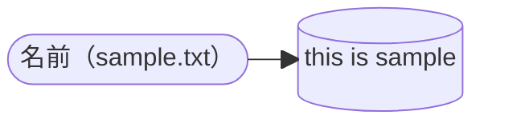
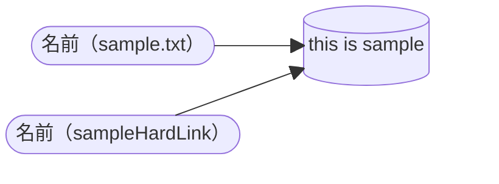
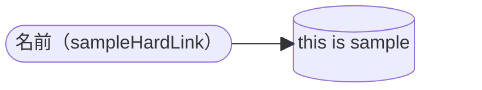
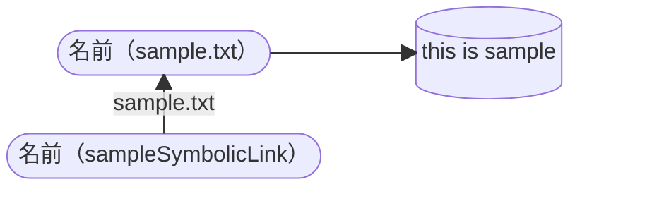
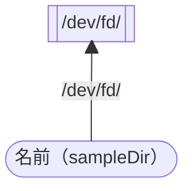
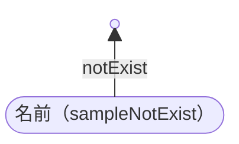

# 前提

今回はUbuntuで説明します

```shell
$ cat /etc/lsb-release
DISTRIB_ID=Ubuntu
DISTRIB_RELEASE=24.04
DISTRIB_CODENAME=noble
DISTRIB_DESCRIPTION="Ubuntu 24.04.1 LTS"
```

# 説明

## ハードリンク

> ハード・リンクは、単にリンクと呼ばれることもあり、 実際のオブジェクトにリンクしていなければなりません。
> 
> (ファイルをディレクトリーにコピーするなどの方法で) ディレクトリー内にオブジェクトが作成されると、 ディレクトリーとオブジェクトの間に最初のハード・リンクが設定されます。

[ハードリンク](https://www.ibm.com/docs/ja/i/7.5?topic=link-hard)

ハードリンクとは、「ファイル名と保存されているデータを紐づけるもの」です。

つまり、「保存されたデータに名前を付けるもの」です。

また、ハードリンクは同一のファイルシステムの保存されたデータに紐づける必要があります。

> Every file on the Linux filesystem starts with a single hard link. The link is between the filename and the actual data stored on the filesystem.
>
> 引用：[Red Hatブログ](https://www.redhat.com/ja/blog/linking-linux-explained)

### 実演

`this is sample` と記載されている `sample.txt` を作成します。

```shell
$ echo "this is sample" > sample.txt
```
```shell
$ ls -li
total 4
655373 -rw-rw-r-- 1 ubuntu ubuntu 15 Oct 23 07:47 sample.txt
```
```shell
$ cat sample.txt
this is sample
```

このコマンドの裏でLinuxのファイルシステムが、ストレージに保存された `this is sample` というデータに`sample.txt`という名前を付けるハードリンクを作成しています。



さらに追加でハードリンクを作成してみます。

```shell
$ ln sample.txt sampleHardLink
```
```shell
$ ls -li
total 8
655373 -rw-rw-r-- 2 ubuntu ubuntu 15 Oct 23 07:47 sample.txt
655373 -rw-rw-r-- 2 ubuntu ubuntu 15 Oct 23 07:47 sampleHardLink
```
```shell
$ cat sampleHardLink
this is sample
```

これにより、 `this is sample` のデータに `sampleHardLink` という名前を付けるハードリンクが作成されました。



ここで `sample.txt` を消すとどうなるでしょうか？

試してみましょう。

```shell
$ rm sample.txt
```
```shell
$ ls -li
total 4
655373 -rw-rw-r-- 1 ubuntu ubuntu 15 Oct 23 09:02 sampleHardLink
```

`sample.txt` の名前だけが消えて、`sampleHardLink` の名前だけが残る形となりました。




余談ですが、データは自身へのハードリンクが全て削除された時に、ドライブから削除されます。

つまり、自分に付けられた名前がすべてなくなった時にデータが削除されます。

```shell
$ rm sampleHardLink
```
```shell
$ ls -li
total 0
```

> The data is only removed from your drive when all links to the data have been removed.
> 
> 引用：[Red Hatブログ](https://www.redhat.com/ja/blog/linking-linux-explained)

## シンボリック・リンク

シンボリックリンクとは、直訳すると「抽象的なリンク」です。

抽象的なリンクなので、保存されたデータでなくても名前を付けることができます。

ディレクトリやファイルディスクリプタなどの特殊ファイルにも名前を付けることができます。

誤解を恐れずに言うと「名前に付ける名前」みたいなものです。

シンボリックリンクは複数のファイルシステムにまたがることができます。

> Commonly referred to as symbolic links, soft links link together non-regular and regular files. 
> 
> They can also span multiple filesystems.
>
> 引用：[Red Hatブログ](https://www.redhat.com/ja/blog/linking-linux-explained)

## 実演

ハードリンクと同じ状況にします。

`this is sample` と記載されている`sample.txt`を作成します。

```shell
$ echo "this is sample" > sample.txt
```
```shell
$ ls -li
total 4
655373 -rw-rw-r-- 1 ubuntu ubuntu 15 Oct 23 03:09 sample.txt
```
```shell
$ cat sample.txt
this is sample
```


それではシンボリックリンクを貼ってみます。

```shell
$ ln -s sample.txt sampleSymbolicLink
```

```shell
$ ls -li
total 4
655373 -rw-rw-r-- 1 ubuntu ubuntu 15 Oct 23 10:41 sample.txt
655375 lrwxrwxrwx 1 ubuntu ubuntu 10 Oct 23 10:50 sampleSymbolicLink -> sample.txt
```
```shell
$ cat sampleSymbolicLink
this is sample
```

ここで `sampleSymbolicLink` の詳細について見てみます。

```shell
$ stat sampleSymbolicLink
  File: sampleSymbolicLink -> sample.txt
  Size: 10        	Blocks: 0          IO Block: 4096   symbolic link
Device: 252,0	Inode: 655375      Links: 1
Access: (0777/lrwxrwxrwx)  Uid: ( 1000/  ubuntu)   Gid: ( 1000/  ubuntu)
Access: 2024-10-23 10:50:28.746456839 +0000
Modify: 2024-10-23 10:50:26.815458100 +0000
Change: 2024-10-23 10:50:26.815458100 +0000
 Birth: 2024-10-23 10:50:26.815458100 +0000
```

シンボリックリンクのリンク先が `sample.txt` であることがわかります。



シンボリックリンクはディレクトリにも貼ることができます。

```shell
$ ln -s /dev/fd/ sampleDir
```
```shell
ls -li
total 4
655373 -rw-rw-r-- 1 ubuntu ubuntu 15 Oct 23 10:41 sample.txt
655376 lrwxrwxrwx 1 ubuntu ubuntu  8 Oct 23 11:04 sampleDir -> /dev/fd/
655375 lrwxrwxrwx 1 ubuntu ubuntu 10 Oct 23 10:50 sampleSymbolicLink -> sample.txt
```
```shell
$ ls -li sampleDir/
total 0
36771 lrwx------ 1 ubuntu ubuntu 64 Oct 23 11:04 0 -> /dev/pts/0
36772 lrwx------ 1 ubuntu ubuntu 64 Oct 23 11:04 1 -> /dev/pts/0
36773 lrwx------ 1 ubuntu ubuntu 64 Oct 23 11:04 2 -> /dev/pts/0
36774 lr-x------ 1 ubuntu ubuntu 64 Oct 23 11:04 3 -> /proc/18762/fd
36775 lr-x------ 1 ubuntu ubuntu 64 Oct 23 11:04 63 -> 'pipe:[24058]'
```



ちなみに、シンボリックリンクは実態がないものにも貼ることができます。

```shell
$ ln -s notExist sampleNotExist
```
```shell
$ ls -li
total 4
655373 -rw-rw-r-- 1 ubuntu ubuntu 15 Oct 23 10:41 sample.txt
655376 lrwxrwxrwx 1 ubuntu ubuntu  8 Oct 23 11:04 sampleDir -> /dev/fd/
655377 lrwxrwxrwx 1 ubuntu ubuntu  8 Oct 23 11:15 sampleNotExist -> notExist
655375 lrwxrwxrwx 1 ubuntu ubuntu 10 Oct 23 10:50 sampleSymbolicLink -> sample.txt
```
```shell
$ cat sampleNotExist
cat: sampleNotExist: No such file or directory
```


シンボリックリンクを削除しても元のファイル等は削除されません。

```shell
$ rm sampleSymbolicLink
```
```shell
ls -li
total 4
655373 -rw-rw-r-- 1 ubuntu ubuntu 15 Oct 23 10:41 sample.txt
655376 lrwxrwxrwx 1 ubuntu ubuntu  8 Oct 23 11:04 sampleDir -> /dev/fd/
655377 lrwxrwxrwx 1 ubuntu ubuntu  8 Oct 23 11:15 sampleNotExist -> notExist
```
```shell
$ cat sample.txt
this is sample
```


# まとめ

シンボリックリンクとハードリンクについてまとめてみました。

少しでも学びになってもらえれば嬉しいです。

# 参考

[ハードリンク](https://www.ibm.com/docs/ja/i/7.5?topic=link-hard)

[シンボリック・リンク](https://www.ibm.com/docs/ja/i/7.5?topic=link-symbolic)

[ふつうのLinuxプログラミング 第2版 第10章](https://i.loveruby.net/stdlinux2/)
