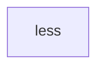
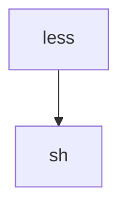
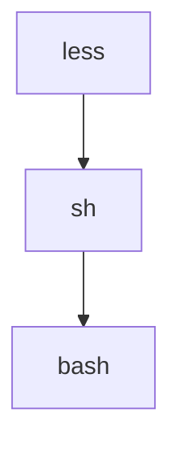
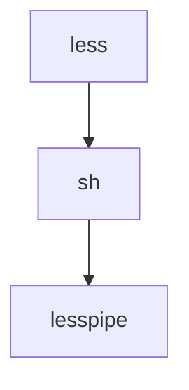
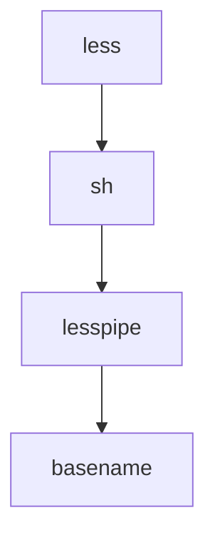

# 結論

環境変数の設定次第。

シェルが起動するようにもできるし、起動しないようにもできる。

lessはpreprocessor経由でファイルの解凍をしていることが理解できた。

# はじめに

[この記事](https://zenn.dev/higaki/articles/bat-command-process)で`less`が`sh`や`lesspipe`が裏側で起動していることを発見しました。

どのようにこれらを呼び出しているか調べたくなったので、この記事にまとめることにしました。

# 環境

- Proxmox VE
  - Ubuntu 24.04

# lessコマンド

https://greenwoodsoftware.com/less/

less コマンドはオープンソースのファイルページャーです。

## まずはlessを実行してみる

lessは圧縮されたファイルも読み込めるということは知っていました。なので、普通のテキストファイルと圧縮されたファイルの両方を読み込んでみます。

まずは、適当なサンプルテキストをlessで読み込んでみます。

```shell
$ echo "this is sample text" > sample.txt
$ less sample.txt
```

```shell
this is sample text
~
~
```

次に、圧縮した場合も見てみます。

```shell
$ gzip sample.txt
$ less sample.txt.gz
```

```shell
this is sample text
~
~
```

同様にsample.txtの内容が見れています。

## システムコールを見てみる

この時のシステムコールを見てみます。

```shell
$ strace -f -o less_execve -e execve less sample.txt
```

```shell
$ cat less_execve 
103504 execve("/usr/bin/less", ["less", "sample.txt"], 0x7ffc9a5b4b40 /* 28 vars */) = 0
103505 execve("/bin/sh", ["sh", "-c", "--", "/bin/bash -c \\ /usr/bin/lesspipe"...], 0x7fff155abbc0 /* 28 vars */) = 0
103506 execve("/bin/bash", ["/bin/bash", "-c", " /usr/bin/lesspipe sample.txt"], 0x5e18559c19a8 /* 28 vars */) = 0
103506 execve("/usr/bin/lesspipe", ["/usr/bin/lesspipe", "sample.txt"], 0x55ee468a66b0 /* 28 vars */) = 0
103507 execve("/usr/bin/basename", ["basename", "/usr/bin/lesspipe"], 0x637d5680ea88 /* 28 vars */) = 0
103507 +++ exited with 0 +++
103506 --- SIGCHLD {si_signo=SIGCHLD, si_code=CLD_EXITED, si_pid=103507, si_uid=1000, si_status=0, si_utime=0, si_stime=0} ---
103510 +++ exited with 0 +++
103509 --- SIGCHLD {si_signo=SIGCHLD, si_code=CLD_EXITED, si_pid=103510, si_uid=1000, si_status=0, si_utime=0, si_stime=0} ---
103511 execve("/usr/bin/tr", ["tr", "[:upper:]", "[:lower:]"], 0x637d5681aa20 /* 28 vars */) = 0
103511 +++ exited with 0 +++
103509 --- SIGCHLD {si_signo=SIGCHLD, si_code=CLD_EXITED, si_pid=103511, si_uid=1000, si_status=0, si_utime=0, si_stime=0} ---
103509 +++ exited with 0 +++
103508 --- SIGCHLD {si_signo=SIGCHLD, si_code=CLD_EXITED, si_pid=103509, si_uid=1000, si_status=0, si_utime=0, si_stime=0} ---
103508 +++ exited with 0 +++
103506 --- SIGCHLD {si_signo=SIGCHLD, si_code=CLD_EXITED, si_pid=103508, si_uid=1000, si_status=0, si_utime=0, si_stime=0} ---
103506 +++ exited with 0 +++
103505 --- SIGCHLD {si_signo=SIGCHLD, si_code=CLD_EXITED, si_pid=103506, si_uid=1000, si_status=0, si_utime=0, si_stime=0} ---
103505 +++ exited with 0 +++
103504 --- SIGCHLD {si_signo=SIGCHLD, si_code=CLD_EXITED, si_pid=103505, si_uid=1000, si_status=0, si_utime=0, si_stime=0} ---
103504 --- SIGWINCH {si_signo=SIGWINCH, si_code=SI_KERNEL} ---
103504 +++ exited with 0 +++
```

`sh`や`lesspipe`が呼び出されています。

先に答えを言うと以下のようになります。

まず、lessプロセスが生成されます。

```shell
103504 execve("/usr/bin/less", ["less", "sample.txt"], 0x7ffc9a5b4b40 /* 28 vars */) = 0
```



次にshのプロセスが生成されます。

```shell
103505 execve("/bin/sh", ["sh", "-c", "--", "/bin/bash -c \\ /usr/bin/lesspipe"...], 0x7fff155abbc0 /* 28 vars */) = 0
```



shのプロセスからbashのプロセスが生成されます。

```shell
103506 execve("/bin/bash", ["/bin/bash", "-c", " /usr/bin/lesspipe sample.txt"], 0x5e18559c19a8 /* 28 vars */) = 0
```



bashは`-c`のオプションがついていたので、最適化のために自分自身のプロセスでそのままlesspipeを実行します。

詳細は[こちらの記事を見てください](https://zenn.dev/higaki/articles/bat-command-process)

```shell
103506 execve("/usr/bin/lesspipe", ["/usr/bin/lesspipe", "sample.txt"], 0x55ee468a66b0 /* 28 vars */) = 0
```



こちらは詳細を見ていくとわかるのですが、lesspipeのプロセスがbasenameのプロセスを生成しています。

```shell
103507 execve("/usr/bin/basename", ["basename", "/usr/bin/lesspipe"], 0x637d5680ea88 /* 28 vars */) = 0
```


## 本当にlesspipeがbasenameを生成しているのか?

以下のコマンドでlesspipeを起動して確かめてみましょう。

```shell
$ LESSOPEN="| strace -o lesspipe_execve -e execve -f /usr/bin/lesspipe %s" less sample.txt.gz
```

これで`lesspipe_execve`が作成されたはずです。

中身を見てみると、

```shell
$ cat lesspipe_execve
106157 execve("/usr/bin/lesspipe", ["/usr/bin/lesspipe", "sample.txt.gz"], 0x7ffc8a8f40f0 /* 28 vars */) = 0
106158 execve("/usr/bin/basename", ["basename", "/usr/bin/lesspipe"], 0x55fdef6d2a88 /* 28 vars */) = 0
106158 +++ exited with 0 +++
106157 --- SIGCHLD {si_signo=SIGCHLD, si_code=CLD_EXITED, si_pid=106158, si_uid=1000, si_status=0, si_utime=0, si_stime=0} ---
106161 +++ exited with 0 +++
106160 --- SIGCHLD {si_signo=SIGCHLD, si_code=CLD_EXITED, si_pid=106161, si_uid=1000, si_status=0, si_utime=0, si_stime=0} ---
106162 execve("/usr/bin/tr", ["tr", "[:upper:]", "[:lower:]"], 0x55fdef6dea20 /* 28 vars */) = 0
106162 +++ exited with 0 +++
106160 --- SIGCHLD {si_signo=SIGCHLD, si_code=CLD_EXITED, si_pid=106162, si_uid=1000, si_status=0, si_utime=0, si_stime=0} ---
106160 +++ exited with 0 +++
106159 --- SIGCHLD {si_signo=SIGCHLD, si_code=CLD_EXITED, si_pid=106160, si_uid=1000, si_status=0, si_utime=0, si_stime=0} ---
106159 execve("/usr/bin/gzip", ["gzip", "-dc", "sample.txt.gz"], 0x55fdef6dea30 /* 28 vars */) = 0
106159 +++ exited with 0 +++
106157 --- SIGCHLD {si_signo=SIGCHLD, si_code=CLD_EXITED, si_pid=106159, si_uid=1000, si_status=0, si_utime=0, si_stime=0} ---
106157 +++ exited with 0 +++
```

```shell
106158 execve("/usr/bin/basename", ["basename", "/usr/bin/lesspipe"], 0x55fdef6d2a88 /* 28 vars */) = 0
```

が表示されているため、

lesspipeのプロセスからbasenameが生成されていることがわかります。


## lessのマニュアルを見る

ここで、lessのマニュアルを見てみます。

```shell
$ man less
```

今回の範囲に関係しそうな部分を抜粋すると、

```
INPUT PREPROCESSOR
       You may define an "input preprocessor" for less.  Before less opens a file, it first gives your input preprocessor a chance to modify the way the contents of the file are
       displayed.  An input preprocessor is simply an executable program (or shell script), which writes the contents of the file to a different file, called the replacement
       file.  The contents of the replacement file are then displayed in place of the contents of the original file.  However, it will appear to the user as if the original file
       is opened; that is, less will display the original filename as the name of the current file.
...

ENVIRONMENT VARIABLES

...

       LESSOPEN
              Command line to invoke the (optional) input-preprocessor.

```

lessは圧縮ファイルの解凍などless実行の前処理を行うことができます。

どのような前処理を行うかは環境変数の`LESSOPEN`に記載されています。


:::details DESCRIPTION

```
DESCRIPTION
       Less  is a program similar to more(1), but it has many more features.  Less does not have to read the entire input file before starting, so with large input files it starts up
       faster than text editors like vi(1).  Less uses termcap (or terminfo on some systems), so it can run on a variety of terminals.  There is even  limited  support  for  hardcopy
       terminals.  (On a hardcopy terminal, lines which should be printed at the top of the screen are prefixed with a caret.)
```

:::

:::details INPUT PREPROCESSOR

```
INPUT PREPROCESSOR
       You may define an "input preprocessor" for less.  Before less opens a file, it first gives your input preprocessor a chance to modify the way the contents of the file are
       displayed.  An input preprocessor is simply an executable program (or shell script), which writes the contents of the file to a different file, called the replacement
       file.  The contents of the replacement file are then displayed in place of the contents of the original file.  However, it will appear to the user as if the original file
       is opened; that is, less will display the original filename as the name of the current file.

       An input preprocessor receives one command line argument, the original filename, as entered by the user.  It should create the replacement file, and when finished, print
       the name of the replacement file to its standard output.  If the input preprocessor does not output a replacement filename, less uses the original file, as normal.  The
       input preprocessor is not called when viewing standard input.  To set up an input preprocessor, set the LESSOPEN environment variable to a command line which will invoke
       your input preprocessor.  This command line should include one occurrence of the string "%s", which will be replaced by the filename when the input preprocessor command
       is invoked.

       When less closes a file opened in such a way, it will call another program, called the input postprocessor, which may perform any desired clean-up action (such as
       deleting the replacement file created by LESSOPEN).  This program receives two command line arguments, the original filename as entered by the user, and the name of the
       replacement file.  To set up an input postprocessor, set the LESSCLOSE environment variable to a command line which will invoke your input postprocessor.  It may include
       two occurrences of the string "%s"; the first is replaced with the original name of the file and the second with the name of the replacement file, which was output by
       LESSOPEN.

       For example, on many Unix systems, these two scripts will allow you to keep files in compressed format, but still let less view them directly:

       lessopen.sh:
            #! /bin/sh
            case "$1" in
            *.Z) TEMPFILE=$(mktemp)
                 uncompress -c $1  >$TEMPFILE  2>/dev/null
                 if [ -s $TEMPFILE ]; then
                      echo $TEMPFILE
                 else
                      rm -f $TEMPFILE
                 fi
                 ;;
            esac

       lessclose.sh:
            #! /bin/sh
            rm $2

       To use these scripts, put them both where they can be executed and set LESSOPEN="lessopen.sh %s", and LESSCLOSE="lessclose.sh %s %s".  More complex LESSOPEN and LESSCLOSE
       scripts may be written to accept other types of compressed files, and so on.
 
        It is also possible to set up an input preprocessor to pipe the file data directly to less, rather than putting the data into a replacement file.  This avoids the need to
       decompress the entire file before starting to view it.  An input preprocessor that works this way is called an input pipe.  An input pipe, instead of writing the name of
       a replacement file on its standard output, writes the entire contents of the replacement file on its standard output.  If the input pipe does not write any characters on
       its standard output, then there is no replacement file and less uses the original file, as normal.  To use an input pipe, make the first character in the LESSOPEN
       environment variable a vertical bar (|) to signify that the input preprocessor is an input pipe.  As with non-pipe input preprocessors, the command string must contain
       one occurrence of %s, which is replaced with the filename of the input file.
 
       For example, on many Unix systems, this script will work like the previous example scripts:
 
       lesspipe.sh:
            #! /bin/sh
            case "$1" in
            *.Z) uncompress -c $1  2>/dev/null
                 ;;
            *)   exit 1
                 ;;
            esac
            exit $?
 
       To use this script, put it where it can be executed and set LESSOPEN="|lesspipe.sh %s".
 
       Note that a preprocessor cannot output an empty file, since that is interpreted as meaning there is no replacement, and the original file is used.  To avoid this, if
       LESSOPEN starts with two vertical bars, the exit status of the script becomes meaningful.  If the exit status is zero, the output is considered to be replacement text,
       even if it is empty.  If the exit status is nonzero, any output is ignored and the original file is used.  For compatibility with previous versions of less, if LESSOPEN
       starts with only one vertical bar, the exit status of the preprocessor is ignored.
 
       When an input pipe is used, a LESSCLOSE postprocessor can be used, but it is usually not necessary since there is no replacement file to clean up.  In this case, the
       replacement file name passed to the LESSCLOSE postprocessor is "-".
 
       For compatibility with previous versions of less, the input preprocessor or pipe is not used if less is viewing standard input.  However, if the first character of
       LESSOPEN is a dash (-), the input preprocessor is used on standard input as well as other files.  In this case, the dash is not considered to be part of the preprocessor
       command.  If standard input is being viewed, the input preprocessor is passed a file name consisting of a single dash.  Similarly, if the first two characters of LESSOPEN
       are vertical bar and dash (|-) or two vertical bars and a dash (||-), the input pipe is used on standard input as well as other files.  Again, in this case the dash is
       not considered to be part of the input pipe command.
```

:::

:::details SECURITY

```
SECURITY
       When the environment variable LESSSECURE is set to 1, less runs in a "secure" mode.  This means these features are disabled:

              !      the shell command

              |      the pipe command

              :e     the examine command.

              v      the editing command

              s  -o  log files

              -k     use of lesskey files

              -t     use of tags files

                     metacharacters in filenames, such as *

                     filename completion (TAB, ^L)

       Less can also be compiled to be permanently in "secure" mode.
```

:::

:::details ENVIRONMENT VARIABLES

```
ENVIRONMENT VARIABLES
       Environment variables may be specified either in the system environment as usual, or in a lesskey(1) file.  If environment variables are defined in more than one place,
       variables defined in a local lesskey file take precedence over variables defined in the system environment, which take precedence over variables defined in the system-
       wide lesskey file.

       COLUMNS
              Sets the number of columns on the screen.  Takes precedence over the number of columns specified by the TERM variable.  (But if you have a windowing system which
              supports TIOCGWINSZ or WIOCGETD, the window system's idea of the screen size takes precedence over the LINES and COLUMNS environment variables.)

       EDITOR The name of the editor (used for the v command).

       HOME   Name of the user's home directory (used to find a lesskey file on Unix and OS/2 systems).

       HOMEDRIVE, HOMEPATH
              Concatenation of the HOMEDRIVE and HOMEPATH environment variables is the name of the user's home directory if the HOME variable is not set (only in the Windows
              version).

       INIT   Name of the user's init directory (used to find a lesskey file on OS/2 systems).

       LANG   Language for determining the character set.

       LC_CTYPE
              Language for determining the character set.

       LESS   Options which are passed to less automatically.

       LESSANSIENDCHARS
              Characters which may end an ANSI color escape sequence (default "m").

       LESSANSIMIDCHARS
              Characters which may appear between the ESC character and the end character in an ANSI color escape sequence (default "0123456789:;[?!"'#%()*+ ".

       LESSBINFMT
              Format for displaying non-printable, non-control characters.

       LESSCHARDEF
              Defines a character set.
 
       LESSCHARSET
              Selects a predefined character set.
       LESSCLOSE
              Command line to invoke the (optional) input-postprocessor.
 
       LESSECHO
              Name of the lessecho program (default "lessecho").  The lessecho program is needed to expand metacharacters, such as * and ?, in filenames on Unix systems.
 
       LESSEDIT
              Editor prototype string (used for the v command).  See discussion under PROMPTS.
 
       LESSGLOBALTAGS
              Name of the command used by the -t option to find global tags.  Normally should be set to "global" if your system has the global(1) command.  If not set, global
              tags are not used.
 
       LESSHISTFILE
              Name of the history file used to remember search commands and shell commands between invocations of less.  If set to "-" or "/dev/null", a history file is not
              used.  The default is "$HOME/.lesshst" on Unix systems, "$HOME/_lesshst" on DOS and Windows systems, or "$HOME/lesshst.ini" or "$INIT/lesshst.ini" on OS/2 systems.
 
       LESSHISTSIZE
              The maximum number of commands to save in the history file.  The default is 100.
 
       LESSKEY
              Name of the default lesskey(1) file.
 
       LESSKEY_SYSTEM
              Name of the default system-wide lesskey(1) file.
 
       LESSMETACHARS
              List of characters which are considered "metacharacters" by the shell.
 
       LESSMETAESCAPE
              Prefix which less will add before each metacharacter in a command sent to the shell.  If LESSMETAESCAPE is an empty string, commands containing metacharacters will
              not be passed to the shell.
 
       LESSOPEN
              Command line to invoke the (optional) input-preprocessor.
 
       LESSSECURE
              Runs less in "secure" mode.  See discussion under SECURITY.
        LESSSEPARATOR
              String to be appended to a directory name in filename completion.
 
       LESSUTFBINFMT
              Format for displaying non-printable Unicode code points.
 
       LESS_IS_MORE
              Emulate the more(1) command.
 
       LINES  Sets the number of lines on the screen.  Takes precedence over the number of lines specified by the TERM variable.  (But if you have a windowing system which
              supports TIOCGWINSZ or WIOCGETD, the window system's idea of the screen size takes precedence over the LINES and COLUMNS environment variables.)
 
       MORE   Options which are passed to less automatically when running in more compatible mode.
 
       PATH   User's search path (used to find a lesskey file on MS-DOS and OS/2 systems).
 
       SHELL  The shell used to execute the ! command, as well as to expand filenames.
 
       TERM   The type of terminal on which less is being run.
 
       VISUAL The name of the editor (used for the v command).
```

:::

## `LESSOPEN`を見てみる

では`LESSOPEN`に何が指定されているか見てみます。

```shell
$ env | grep LESSOPEN
LESSOPEN=| /usr/bin/lesspipe %s
```

環境によって違うと思いますが、自分の環境では上記が設定されていました。

自分の環境ではlessの前処理にはlesspipeを使用していそうです。

https://sources.debian.org/src/less/668-1/debian/lesspipe

しかし、自分には`LESSOPEN`を設定した記憶はありません。どのタイミングで設定されていたのでしょうか。

## `LESSOPEN`はいつ設定された?

ここで、`/etc/skel/.bashrc`を見てみると、 以下の記載がありました。

```shell
$ cat /etc/skel/.bashrc | grep lesspipe
# make less more friendly for non-text input files, see lesspipe(1)
[ -x /usr/bin/lesspipe ] && eval "$(SHELL=/bin/sh lesspipe)"
```

`/etc/skel`とは、「新しく作成するユーザのホームディレクトリの雛形」なので、Ubuntuにユーザを追加した時点でbashrcに設定されています。

**参考**

https://envader.plus/course/12/scenario/1129

まずは`lesspipe`について実行してみます。

```shell
$ lesspipe
export LESSOPEN="| /usr/bin/lesspipe %s";
export LESSCLOSE="/usr/bin/lesspipe %s %s";
```

どうやら引数なしで実行すると「環境変数に`LESSOPEN`と`LESSCLOSE`を設定するコマンド」が出力されるようです。

ただこちらは標準出力に表示されただけで実際にこのコマンドが実行されたわけではありません。

これらを`eval`で実際に実行しています。

```shell
$ [ -x /usr/bin/lesspipe ] && eval "$(SHELL=/bin/sh lesspipe)"
```


# まとめ

